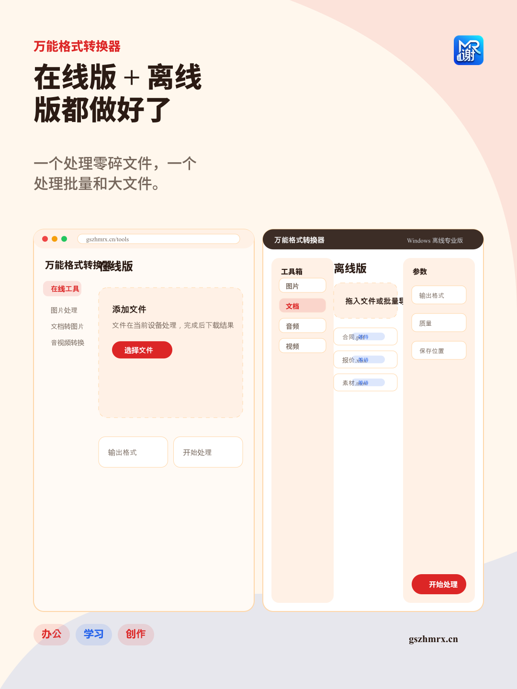
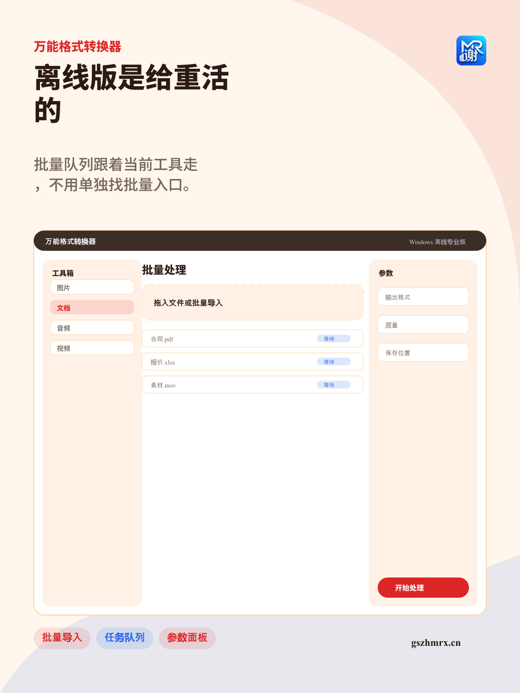

# 小红书宣传文案

## 正文

标题：这个格式转换工具，我终于把在线版和离线版都做出来了

真的不是在制造需求，日常办公里这种小问题太多了：
图片太大传不上去、PDF 想转成图片、Word/Excel 想导出页面、MOV 想转 MP4、视频里只想提取音频。

所以我做了「万能格式转换器」。

在线版适合临时用：
打开网站，选工具，添加文件，处理完自己下载。

Windows 离线专业版适合重一点的场景：
批量文件、大文件、公司资料、客户资料、断网电脑。安装后直接是工具箱界面，左边选功能，中间看任务队列，右边调参数。

我比较坚持的一点：
文件尽量在本地处理，不上传服务器，不调用云端转换 API。

网址：gszhmrx.cn
离线版下载在下载页按说明联系作者拿口令。

#格式转换 #办公效率 #PDF转图片 #图片压缩 #音视频转换 #Windows软件 #本地处理

## 配图

