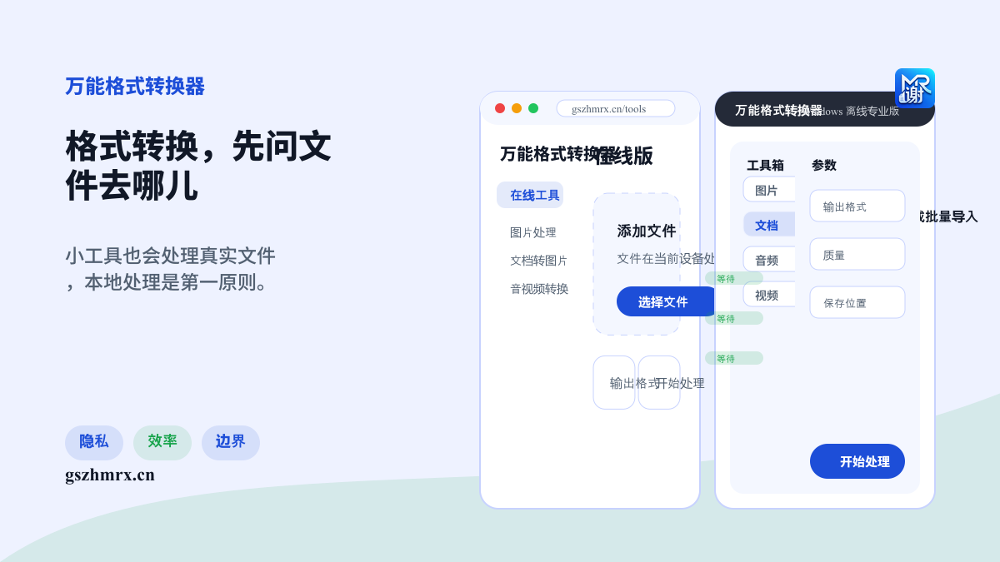
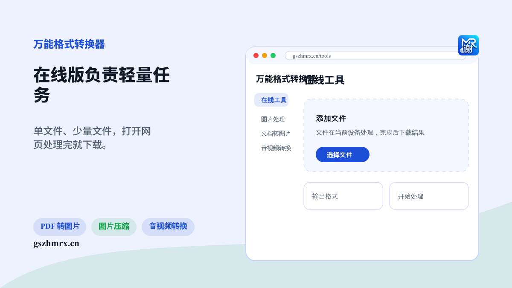
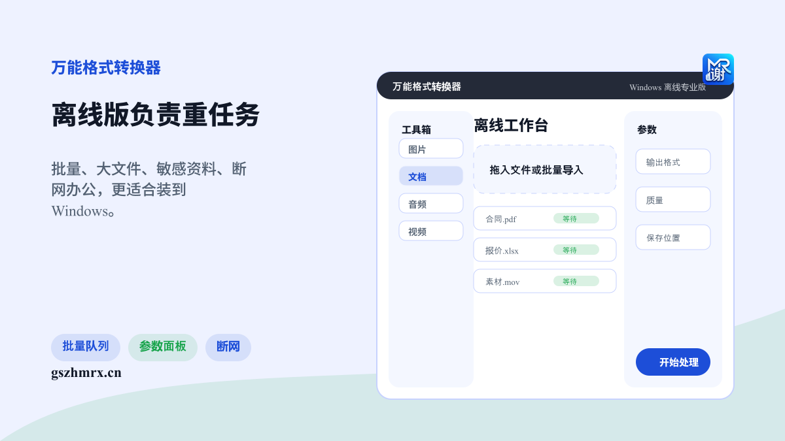
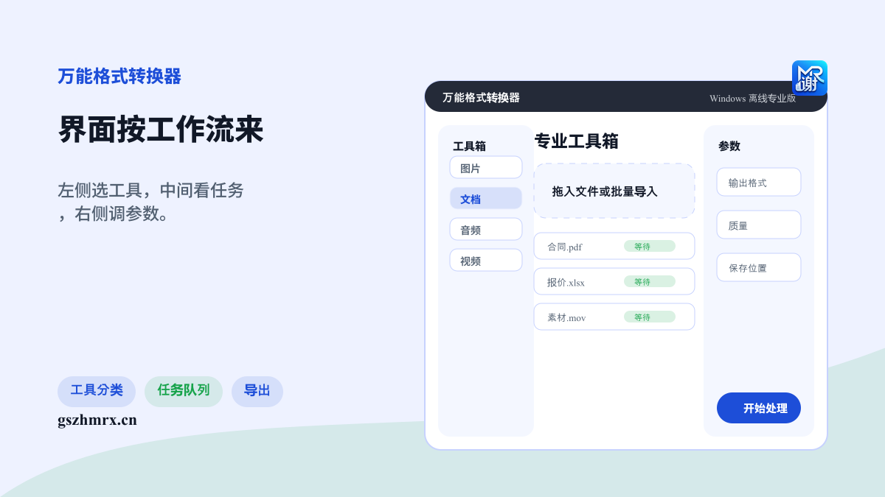
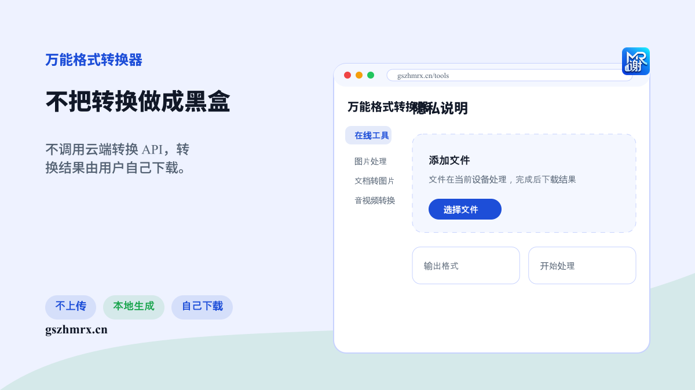
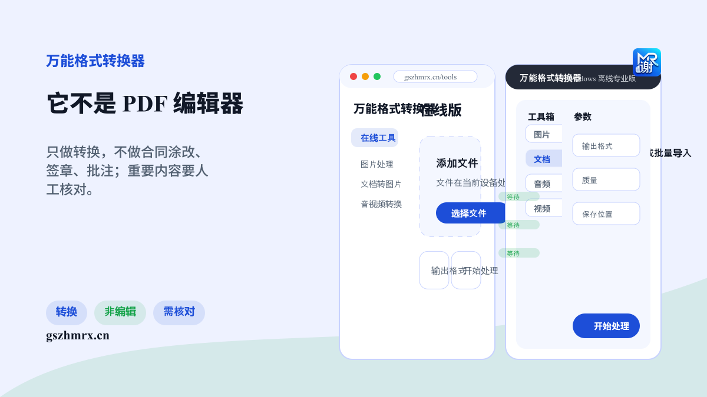

# 知乎宣传文案

## 正文

题目：为什么我做格式转换工具时，优先做了本地处理和离线版？

很多格式转换需求，其实不是“高级功能”。

比如把 PDF 转成图片、压缩一张照片、给图片加水印、把 Word/Excel 页面导出来、把 MOV 转成 MP4、从视频里提取音频。这些事本身不复杂，但用户会有一个很现实的顾虑：文件到底传到哪儿去了？

所以「万能格式转换器」没有走云端转换 API 这条路，而是尽量让文件在浏览器或离线软件本地处理。在线版负责轻量任务，适合临时处理单文件或少量文件；Windows 离线专业版负责批量、大文件、敏感资料和断网办公。

离线版的界面更像工具箱：左侧选类型，中间是上传区和任务队列，右侧调参数。它的核心功能不依赖网站服务器，也不渲染在线广告容器。

当然边界也要说清楚：它是格式转换工具，不是 PDF 编辑器，不提供 PDF 内容修改、涂销、签章、批注。重要文件转换完还是要人工核对。

网址：gszhmrx.cn
离线专业版下载按下载页说明联系作者获取口令。

## 配图

